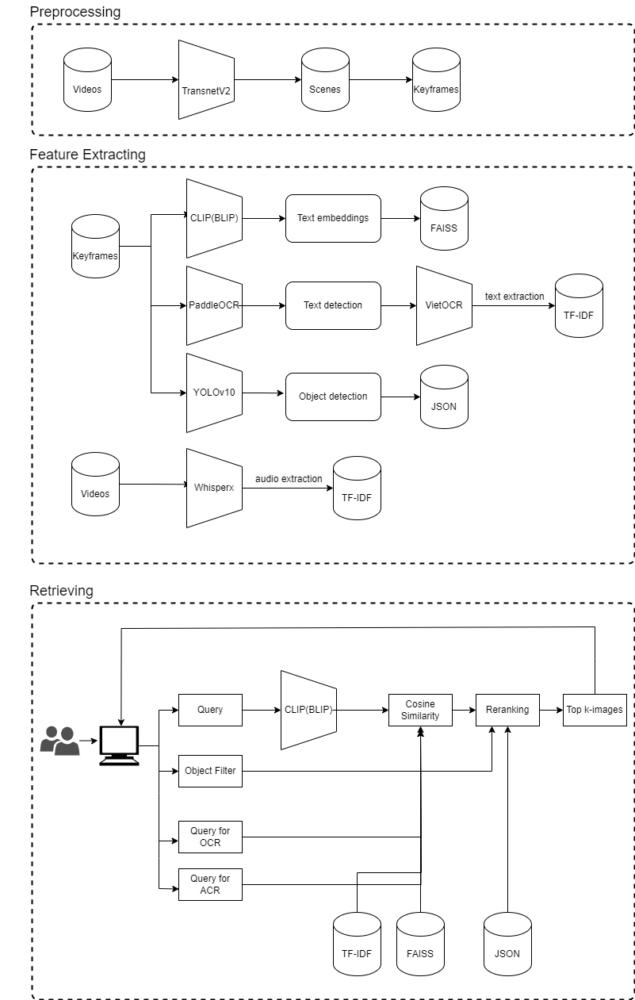

# Video Search with Object Detection Reranking

This project implements a video search system that retrieves keyframes from videos based on text queries. The system includes an object detection reranking mechanism to improve the accuracy of the search results by prioritizing frames containing relevant objects based on the query.

## Pipeline


## Data Structure

```bash
| - Data
    | - audio
    | - audio_detection
    | - blip-features-vitg
    | - clip-features-h14
    | - improved_keyframes
    | - improved_map-keyframes
    | - media-info
    | - ocr
    | - scenes
    | - videos
| - DataPreprocessing
    | - faiss_blip_vitg.bin
    | - faiss_clip_h14.bin
    | - ...
```
## Preprocessing
Further information on: [preprocessing](DataPreprocessing/README.md)
## Installation
To set up the environment, first install the required Python dependencies:
```bash
pip install -r requirements.txt
```
Make sure you have already installed CUDA/cuDNN. In case you don't, just simply install normal torch for yourself.
**NOTE:**
If your gpu doesn't support flash attention or you don't want to waste time for it (approx. 5-6 hours for installation), please remove it from requirements.txt

## Usage
Once the installation is complete, you can start the video search system:
```bash
streamlit run app_test.py
```
